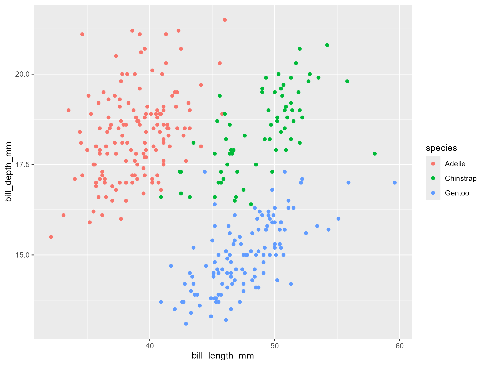

<p align="left">
  
</p>

___
# Data Visualisation Continued: Interactive Visualisations 
#### Created by Ellen Crombie - last updated November 2024
### Tutorial Sections
- Click on these sections to be taken directly to them!
  
#### <a href="#section1"> 1. Introduction to interactive plots using `plotly` </a>

#### <a href="#section2"> 2. Interactive map visualisations using `leaflet` </a>

#### <a href="#section3"> 3. Interactive data dashboards: combining `plotly` and `leaflet`</a>

### Introduction
---------------------------
This tutorial aims to continue building on skills already introduced on the topic of data visualisation by introducing an interactive element to both graphs and maps. Interactivity is an important aspect of data visualisation in the modern world as it is an important tool used by many websites, including the BBC, see a recent example [here](https://www.bbc.co.uk/news/articles/c0lp48ldgyeo), and other more data centred websites such as [Our World in Data](https://ourworldindata.org/).

Interactivity allows the user to gain greater insight into what the plot or map is actually showing __WITHOUT__ cluttering the visualisation or reducing its readability.
### Aims and Steps
-----------------------------
#### Introduction to interactive plots using `plotly`
1. Overview of plotly - installation and importing
2. Basic plotting - plotly vs ggplotly
3. Customisations of tooltips and hover effects
#### Interactive map visualisations using `leaflet`
4. Use of interactive maps
#### Interactive data dashboards: combining `plotly` and `leaflet`


> #### **Note** - All the files you need to complete this tutorial can be downloaded from [this Github repository](https://github.com/EdDataScienceEES/tutorial-ellencrombie.git). Clone and download the repo as a zip file, then unzip it and set the folder as your working directory by running the code underneath (replace with your actual folder path) or clicking `Session/ Set Working Directory/ Choose Directory` from the RStudio menu.


\
\
<a name="section1"></a>

## 1. Introduction to Interactive Plots using `plotly`
#### Overview
Plotly helps help your data to life! you can zoom, pan, hover ... giving new depths to your charts.

__Key Functions and What They Do__

Here's a glossary of some key function within plotly, we will work through highlighting some in particular, but use this bank as a reference for making your own plotly graphs!

| **Function**         | **What It Does**                                                     |
|----------------------|----------------------------------------------------------------------|
| `plot_ly()`          | creates a new Plotly plot from scratch                        |
| `ggplotly()`         | converts ggplots into interactive Plotly plots            |
| `subplot()`          | combines multiple plots into one interactive dashboard              |
| `add_trace()`        | add new data series to a plot (scatter, lines, bars etc.). |
| `layout()`           | customise the layout (titles, axes, legends, etc.)                  |
| `style()`            | change plot elements like colors and hover information          |
| `highlight_key()`    | highlight specific data points interactively      |
| `saveWidget()`       | save your plotly graph as an interactive HTML file so it can be uploaded to websites etc. |

#### Downloading Data and Loading Libraries

Make a new script file by clicking `File/ New File/ R Script`, give it a title and include relevant information like your name, date, contact information.

Within this example we will be using the 'palmerpenguins' dataset, this data was collected and made available by Dr. Kristen Gorman and the Palmer Station, Antarctica LTER.
\
\
__Meet the penguins!__
<p align="center">
  
	Artwork by @allison_horst.
</p>

Data Citation:
Gorman KB, Williams TD, Fraser WR (2014). Ecological sexual dimorphism and environmental variability within a community of Antarctic penguins (genus Pygoscelis). PLoS ONE 9(3):e90081. https://doi.org/10.1371/journal.pone.0090081

This dataset can be called directly into R within libaries.

> Note: use `install.packages("palmerpenguins")` to install this package. Then you can edit within the "" to install any other necessary packages that are used in this tutorial.

```r
## Interactive Plotting of Penguin Data
## Data visualisation continued: A Coding Club Tutorial
## YOUR NAME
## DATE

# Libraries ----
library(palmerpenguins) # Load penguin dataset for analysis and visualisation.
library(ggplot2) # For creating static data visualisations
library(plotly) # # For interactive data visualistation

# Loading data ----
# assign the data as an object - allows easier exploration, you can open the data table from your environment
penguin_data <- na.omit(penguins) # remove na's for ease of plotting
```

#### Basic Plotting
Let's start simply, plotly has two options when creating interactive graphs. The first being to create it directly, using `plot_ly()`. And the second being to convert a static plot from `ggplot2`(like those you have learned how to make in [previous tutorials](https://ourcodingclub.github.io/tutorials/data-vis-2/).
) to an interactive one using `ggplotly()`. 

As you will be familiar with `ggplot` plots, lets start there!
##### Interactive Scatter Plot
Lets begin with a simple plot, the only extra information I'm adding is specifying `colour = species` so we can distinguish data points by penguin species
```r
# Create a ggplot2 scatterplot
(penguin_plot <- ggplot(data = penguins, aes(x = bill_length_mm, y = bill_depth_mm, color = species)) +
  geom_point())
```
It should look like this:



## Interactive Plots of Penguin Data

Now, lets convert this basic plot into an interactive one !
```r
# Convert ggplot2 to plotly
(penguin_plotly <- ggplotly(penguin_plot))
```
<iframe src="Figures/penguin_plotly.html" width="800" height="600"></iframe>

> ### Try hovering your cursor over points on the plot ... what information do you see?
You should see information on penguin ...
1. Bill length
2. Bill depth
3. Species
   
... that relates to the specifc point you are hovering over, and so changes as you move the cursor over the plot.

The information displayed in these tooltips comes from the data supplied when creating the graph in the first place, however the content inside them can be altered to make the interactivity more useful and show information that wouldn't otherwise fit in the plot.

> Tooltips just refer to the little box that appears and provides extra infromation when you hover over data points in plotly graphs.

You should also notice that you can now zoom and pan within the plot, as well as edit how you see see tooltips on this graph, for example you can now 'compare data on hover' this displays multiple tooltips at once. When this is enabled, all data points that share the same x or y coordinate (depending on the plot's layout) display their tooltips simultaneously. This comparison provides additional context by letting you see how multiple points relate to each other.

`hovermode = "x unified"`: Displays tooltips for all points with the same x-coordinate.

`hovermode = "y unified"`: Displays tooltips for all points with the same y-coordinate.

These distinctions are made within `layout()` when you make plot_ly graphs directly, we will further explore this in the next 'plotly graph' section...

> ### Activity : Here you've seen how to make a scatter plot interactive, now try converting some different types of plots using `ggplotly()`.
> 1. Bar Chart of Penguin Abundance (grouped by species)
> 2. Box Plot displaying flipper length
> #### Instructions
> 1. Write code to create the plots using `ggplot2`.
> 2. Convert the plots into interactive graphs using `ggplotly`.
> 3. Check your results against the provided solutions below.

---
<details>
  <summary><b>Click to reveal what the code could look like</b></summary>
	
### Code for Bar Chart


```r
# bar Chart
(bar_chart <- ggplot(data = penguins, aes(x = species, fill = species)) +
  geom_bar() +
  labs(
    title = "Bar Chart of Penguin Species Count",
    x = "Species",
    y = "Count"
  ) +
  theme_minimal())

# convert to interactive plot
(bar_chart_interactive <- ggplotly(bar_chart))
# save plot
htmlwidgets::saveWidget(as_widget(bar_chart_interactive), "Figures/penguin_bar_chart.html")

```

### Code for Box Plot (Penguin Flipper Length Across Species)

```r
# Box Plot
(box_plot <- ggplot(data = penguins, aes(x = species, y = flipper_length_mm, fill = species)) +
    geom_boxplot() +
    labs(
      title = "Box Plot of Flipper Length Across Penguin Species",
      x = "Species",
      y = "Flipper Length (mm)"
    ) +
    theme_minimal())

# Convert to interactive plot
(box_plot_interactive <- ggplotly(box_plot))
# save plot
htmlwidgets::saveWidget(as_widget(box_plot_interactive), "Figures/penguin_box_plot.html")

```

</details>

<details>
  <summary><b>Click to reveal what the graphs could look like</b></summary>

<div style="text-align: center;">
    <iframe src="Figures/penguin_bar_chart.html" width="600" height="400" style="border:none;"></iframe>
</div>

 
<div style="text-align: center;">
    <iframe src="Figures/penguin_box_plot.html" width="600" height="400" style="border:none;"></iframe>
</div>

</details>

##### Plotly graph 

Let's get familiar using the `plot_ly` function to create graphs directly, creating plots directly with this function make it much easier to cutomise the content of the tooltips we just described. So here we will return to the same graph to compare how it can be created using `plot_ly`

`plot_ly` doesnt use `aes()` like `ggplot2`does to map data to visual properties, instead, you directly pass variables from your dataset as arguments to the plotting function using the formula syntax (e.g., ~x, ~y).

Look carefully at the comments on this code before you copy in into your script, as well as customising tooltips it also tidies up the graph, introducing the `layout()` to add custom graph and axes titles.

For the the tooltips specifically, readability is improved by renaming the values incuded to remove any underscores, units (mm) have been added after the values, and the extra information of the `Island` the penguin originated from, and `Sex` has been added. 

Any information that's contained in the data table can be added, so in our case this could include other variables like flipper length or body mass.  

```r
# improved interactive plot
(penguin_plotly_2 <- plot_ly(
  data = penguin_data,
  x = ~bill_length_mm,
  y = ~bill_depth_mm,
  color = ~species,  # different colors for species
  text = ~paste(
    "Species:", species, # this information specifies what should be inlcuded
    "<br>Bill Length:", bill_length_mm, "mm", # in the tooltips
    "<br>Bill Depth:", bill_depth_mm, "mm",
    "<br>Island:", island,
    "<br>Sex:", sex
  ),
  hoverinfo = "text",  # display the customised text in tooltips
  type = "scatter",
  mode = "markers"     # Scatterplot with points
) %>%
  layout( # used to add titles to plots and axes
    title = "Interactive Scatter Plot of Penguin Bill Data",
    xaxis = list(title = "Bill Length (mm)"),
    yaxis = list(title = "Bill Depth (mm)")
  ))

# save the improved plot as a HTML file
htmlwidgets::saveWidget(as_widget(penguin_plotly_2), "code_output/penguin_plotly_2.html")

```

<iframe src="Figures/penguin_plotly_2.html" width="800" height="600"></iframe>

That looks clearer now! The use of hover effects and tooltips on your own graphs is entirely determined by what you want to get across so think carefully about the purpose and audience of your plots when making edits to them. 

In our glossary ealier `style()` was introduced, have a play around with this. It is used to edit the appearance of tooltips. Some example code is provided below, this would be added via a pipe `%>%` after our edits made to layout.

As an activity, edit these colours and fonts to get comfortable with the function.

```r
# add this on to previous code from the graph
%>%
  style(  # change the hover text appearance
    hoverlabel = list(
      bgcolor = "white",      # Background color of tooltip
      font = list(size = 12, color = "black"),  # Font size and color
      bordercolor = "black" # Border color of tooltip
    )))
```
The topics we have covered 
> the colours of text and background in tooltips can be of particluar importance when considering users with colour blindness. You want to ensure the plot is accessible to all viewers so remember to consider clarity.

This intorduction to `plotly` has focused a on scatter plot but it spans a wide range of graphs, and the tools above can be applied in a similar way to plots such as  line graphs, histograms, box plots, pie charts etc.

<a name="section2"></a>

## 2. Interactive map visualisations using `leaflet`


```r


```


```r

```


```r

```

At this point it would be a good idea to include an image of what the plot is meant to look like so students can check they've done it right. Replace `IMAGE_NAME.png` with your own image file:

<center>  </center>

<a name="section3"></a>

## 3. Interactive data dashboards: combining `plotly` and `leaflet`

More text, code and images.

This is the end of the tutorial. Summarise what the student has learned, possibly even with a list of learning outcomes. In this tutorial we learned:

##### - how to generate fake bivariate data
##### - how to create a scatterplot in ggplot2
##### - some of the different plot methods in ggplot2

We can also provide some useful links, include a contact form and a way to send feedback.

For more on `ggplot2`, read the official <a href="https://www.rstudio.com/wp-content/uploads/2015/03/ggplot2-cheatsheet.pdf" target="_blank">ggplot2 cheatsheet</a>.

Everything below this is footer material - text and links that appears at the end of all of your tutorials.

<hr>
<hr>

#### Related Tutorials
- [Data Visualisation: Part 1](https://ourcodingclub.github.io/tutorials/datavis/)
- [Data Visualisation: Part 2](https://ourcodingclub.github.io/tutorials/data-vis-2/)

#### Check out our <a href="https://ourcodingclub.github.io/links/" target="_blank">Useful links</a> page where you can find loads of guides and cheatsheets.

#### If you have any questions about completing this tutorial, please contact us on ourcodingclub@gmail.com


<ul class="social-icons">
	<li>
		<h3>
			<a href="https://twitter.com/our_codingclub" target="_blank">&nbsp;Follow our coding adventures on Twitter! <i class="fa fa-twitter"></i></a>
		</h3>
	</li>
</ul>
